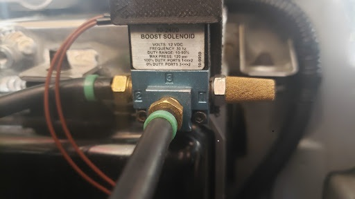
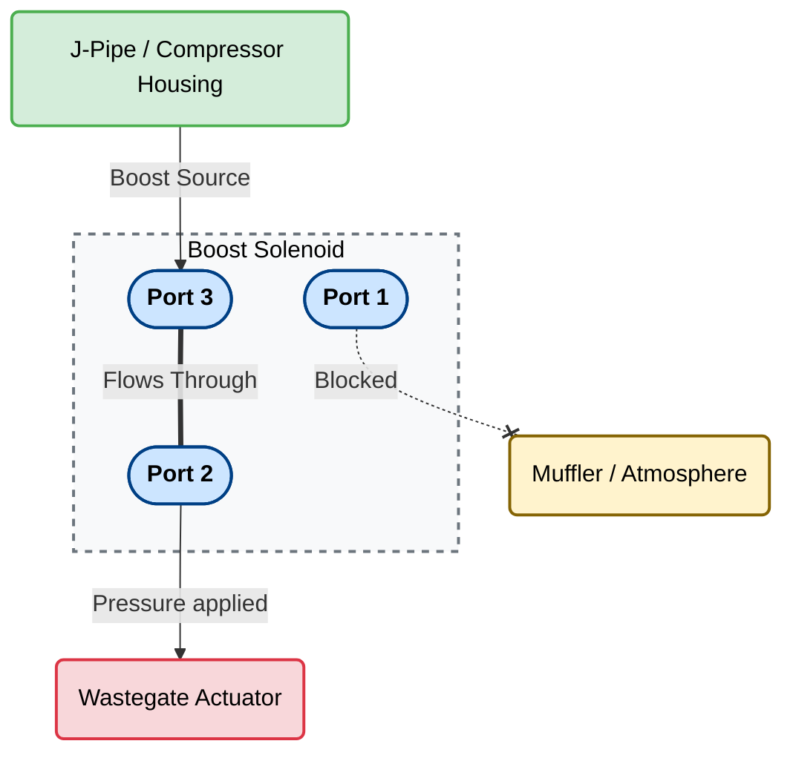
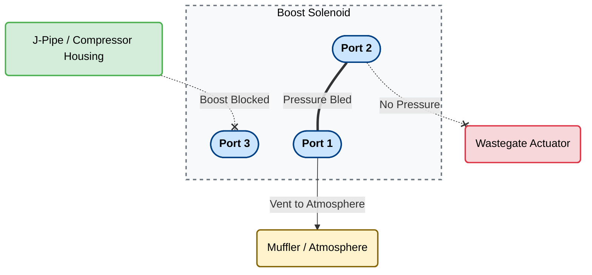

# Modifications — 2003 Evo VIII

> YouTube channel: https://www.youtube.com/@bradgutch — shorts for this car have titles starting with **"Evo 8"**

## K&N Typhoon Cold Air Intake

| Field       | Value                          |
|-------------|-------------------------------|
| Part        | K&N Typhoon Cold Air Intake    |
| Installed   | 2003–2014 (exact date unknown) |
| Purpose     | Increased airflow to the turbo |

**References / YouTube Shorts:** https://www.youtube.com/@bradgutch *(find short titled "Evo 8 …" and add link here)*

---

## New Windshield

| Field     | Value                         |
|-----------|------------------------------|
| Installed | 2003–2014 (exact date unknown)|
| Reason    | Replacement                   |

**References / YouTube Shorts:** https://www.youtube.com/@bradgutch *(find short titled "Evo 8 …" and add link here)*

---

## New Front Bumper

| Field     | Value                         |
|-----------|------------------------------|
| Installed | 2003–2014 (exact date unknown)|
| Reason    | Replacement                   |

**References / YouTube Shorts:** https://www.youtube.com/@bradgutch *(find short titled "Evo 8 …" and add link here)*

---

## Aftermarket Intercooler

| Field       | Value                                        |
|-------------|---------------------------------------------|
| Part        | Slightly larger aftermarket intercooler      |
| Vendor      | Unknown                                      |
| Installed   | 2014–2026 (exact date unknown)               |
| Purpose     | Improved charge cooling over stock unit      |

**References / YouTube Shorts:** https://www.youtube.com/@bradgutch *(find short titled "Evo 8 …" and add link here)*

---

## Meagan Racing Radiator

| Field       | Value                                        |
|-------------|---------------------------------------------|
| Part        | Meagan Racing Radiator                       |
| Installed   | On or around Dec 3, 2025                     |
| Purpose     | Improved cooling capacity                    |

**References / YouTube Shorts:** https://youtube.com/shorts/M4zNpgPBOyk?si=UKC8vTpiQe7WUJKZ

---

## Exedy Flywheel and Clutch Kit

| Field       | Value                                                                      |
|-------------|---------------------------------------------------------------------------|
| Flywheel    | Exedy MF04 Chromoly Racing Flywheel                                        |
| Clutch      | Exedy Sport Clutch Kit — Part # 05803HD                                    |
| Installed   | 2014–2026 (exact date unknown)                                             |
| Purpose     | Reduced rotating mass, improved clutch engagement for performance driving  |

**References / YouTube Shorts:** https://www.youtube.com/@bradgutch *(find short titled "Evo 8 …" and add link here)*

---

## Right and Left Drip Moldings Replacement

| Field     | Value           |
|-----------|-----------------|
| Installed | March 2, 2026   |
| Reason    | Replacement     |

**Data Logs:** [EvoScanDataLog_2026.03.02_18.01.58.csv](../../logs/EvoScanDataLog_2026.03.02_18.01.58.csv)

**References / YouTube Shorts:** https://youtube.com/shorts/UXUkUpyreZQ?si=6SoOyYVxbmHiZqml

---

## Exhaust System Upgrade (Down Pipe Back)

| Field       | Value                                                |
|-------------|------------------------------------------------------|
| Race Pipe   | Boosted Fabrication Resonated Race Pipe (Ultra Quiet Style) |
| Cat-Back    | Tomei Titanium Cat-Back Exhaust                      |
| Installed   | March 2, 2026                                        |
| Purpose     | Performance exhaust upgrade — replaced from down pipe back |

**Over-Boost Condition & ECU Fuel Cut:** Data logs captured after this modification revealed a critical over-boost event that triggered an ECU fuel cut (the audible "boom").

**The Breakdown:**
1. **The Overboost Spike:** At approximately 3,400 RPM under 100% throttle, MAP sensor hit **47.78 psia**. This translates to **33.08 psi of boost** (47.78 psia - 14.7 atmospheric = 33.08 psig). [...]

2. **Root Cause - WGDC at 100%:** The log shows Wastegate Duty Cycle (WGDC) was pegged at **100.0%** during the entire pull. In the Evo ECU, 100% duty cycle means the solenoid is keeping the wast[...]

3. **The "Loud Boom" (Fuel Cut):** When the ECU detected 33 psi, it hit the Boost Cut / Load Limit and immediately cut fuel to the injectors while under heavy load. This violent event is the ECU'[...] 

**Action Required:** ECU tuning adjustment needed to prevent wastegate duty cycle from staying at 100% with the new low-backpressure exhaust system.

**Data Logs:** [EvoScanDataLog_2026.03.02_18.01.58.csv](../../logs/EvoScanDataLog_2026.03.02_18.01.58.csv) — see MAP column

**References / YouTube Shorts:** https://www.youtube.com/@bradgutch *(find short titled "Evo 8 …" and add link here)*

---

## STM Evo 7/8/9 O2 Downpipe — OEM-Style Housing

| Field       | Value                                                |
|-------------|------------------------------------------------------|
| Part        | STM Evo 7/8/9 O2 Downpipe Recirculated for OEM-Style Housing |
| Technician  | Eli at Tuned Up LLC                                  |
| Installed   | March 20, 2026                                       |
| Purpose     | Remove the factory downpipe restriction and improve exhaust flow |

**Notes:** The STM downpipe was installed by Tuned Up LLC along with the rear bushing replacement. This completes the latest exhaust hardware change and pairs with the existing Boosted Fabricatio[...]

**Data Logs:**
- [EvoScanDataLog_2026.03.21_09.22.49.csv](../../logs/EvoScanDataLog_2026.03.21_09.22.49.csv)
- [EvoScanDataLog_2026.03.21_09.25.58.csv](../../logs/EvoScanDataLog_2026.03.21_09.25.58.csv)

---

## Rear Bushing Replacement

| Field       | Value                      |
|-------------|----------------------------|
| Installed   | March 20, 2026             |
| Reason      | Replacement / refresh      |
| Shop        | Tuned Up LLC               |

**Notes:** Rear bushings were replaced during the same service visit as the STM downpipe installation.

**Data Logs:**
- [EvoScanDataLog_2026.03.21_09.22.49.csv](../../logs/EvoScanDataLog_2026.03.21_09.22.49.csv)
- [EvoScanDataLog_2026.03.21_09.25.58.csv](../../logs/EvoScanDataLog_2026.03.21_09.25.58.csv)

---

## Boost Solenoid Vent — Muffler Redirect

| Field       | Value                                                |
|-------------|------------------------------------------------------|
| Installed   | April 5, 2026 (Easter 2026)                          |
| Reason      | Resolve boost solenoid issues; reduce intake contamination |
| Purpose     | Redirect boost solenoid vent from intake/input to a dedicated muffler |

**Notes:** Previously, the boost solenoid (3-port wastegate solenoid) was venting back to the intake/input. The vent line has been rerouted to a muffler so it vents to atmosphere through the muff[...] 

**References / YouTube Shorts:** https://www.youtube.com/@bradgutch *(find short titled "Evo 8 …" and add link here)*

---

## ROM Flash — `e8-t030-disable_cat.hex`

| Field       | Value |
|-------------|-------|
| ROM       | `e8-t030-disable_cat.hex` |
| Flash Log | `030_tune.log` |
| Flashed   | March 21, 2026 |
| Purpose   | Disable cat-related behavior after the downpipe install |

**Notes:** The flash completed successfully and the verify pass matched all ECU pages. The log shows only `FB01` changed, which is consistent with a targeted tune update.

**Data Logs:**
- [EvoScanDataLog_2026.03.21_09.22.49.csv](../../logs/EvoScanDataLog_2026.03.21_09.22.49.csv)
- [EvoScanDataLog_2026.03.21_09.25.58.csv](../../logs/EvoScanDataLog_2026.03.21_09.25.58.csv)

---

## AEM TruBoost Controller Relocation

| Field       | Value                          |
|-------------|-------------------------------|
| Part        | AEM TruBoost Controller        |
| Date        | April 25, 2026                |
| Purpose     | Relocate for better access/performance |

**Notes:**
*   **Date:** 2026-04-25
*   **Mileage:** 96,000 miles

Moved the existing AEM TruBoost controller, mounting the solenoid on the radiator shroud and reconnecting the vacuum lines.

During initial testing, observed significant boost spikes at wide-open throttle. The boost would spike rapidly, causing the ECU to cut throttle or hit a boost limiter, resulting in a sudden drop [...]

The graph above shows the boost pressure (purple line) spiking and then dropping while the throttle position (red line) is still at 100%.

**Recommended Action:**
To smooth out the boost curve and prevent dangerous spikes, the next step is to adjust the wastegate. The plan is to reduce the wastegate crack pressure to make the wastegate open earlier, thus s[...] 

**Data Logs:**
- [EvoScanDataLog_2026.04.25_05.55.56.csv](../../logs/EvoScanDataLog_2026.04.25_05.55.56.csv)
- [EvoScanDataLog_2026.04.25_06.02.25.csv](../../logs/EvoScanDataLog_2026.04.25_06.02.25.csv)

---

## Boost Controller Relocation and Boost Spikes - 2026-04-26

**Mileage:** approx. 96,000 miles

### Description

After relocating the AEM TruBoost controller to the radiator and reconnecting the vacuum lines, testing revealed significant boost control issues. Under wide-open throttle, the boost would spike [...]

The behavior suggests that the wastegate is being forced open prematurely, likely due to the new vacuum line routing or a setting on the boost controller.

### Supporting Data

- [Graph of Boost Drop](cars/2003-evo-viii/logs/boost_drop_04_25_2026.png)
- [Log File 1: EvoScanDataLog_2026.04.26_10.27.50.csv](cars/2003-evo-viii/logs/EvoScanDataLog_2026.04.26_10.27.50.csv)
- [Log File 2: EvoScanDataLog_2026.04.26_10.35.23.csv](cars/2003-evo-viii/logs/EvoScanDataLog_2026.04.26_10.35.23.csv)

### Analysis and Recommendations

The sudden drop in boost pressure, despite the throttle remaining wide open, points to a mechanical or control issue with the wastegate system. Since this issue appeared after relocating the boos[...] 

1.  **Vacuum Line Configuration:** The new routing of the vacuum lines may be causing a pressure differential that is forcing the wastegate open.
2.  **Boost Controller Settings:** The current settings on the AEM TruBoost controller may not be appropriate for the new physical setup.

**Recommendation:**

As a next step, reducing the wastegate crack pressure setting on the AEM TruBoost controller is a reasonable approach to smooth out the boost delivery. If this does not resolve the issue, a thoro[...] 

---

## JD Customs Titanium Hardware (Engine Bay)

| Field       | Value                                                |
|-------------|------------------------------------------------------|
| Part        | Titanium hardware (nuts and bolts)                   |
| Vendor      | JD Customs                                           |
| Installed   | Late April to May 2026                               |
| Purpose     | Weight reduction and corrosion resistance in engine bay |

**Notes:** Additional titanium hardware from JD Customs was used to replace various nuts and bolts in the engine bay. This upgrade provides weight savings and improved corrosion resistance compar[...] 

**References / YouTube Shorts:** https://www.youtube.com/@bradgutch *(find short titled "Evo 8 …" and add link here)*

---

## Boost Leak Testing and Diagnosis

| Field       | Value                                                |
|-------------|------------------------------------------------------|
| Date        | May 2026                                             |
| Status      | Minimal testing completed; issue identified          |

**Notes:** Initial boost leak testing was performed on the car. Testing revealed a whistle behind the battery area that indicates a potential boost leak. Further investigation and repair will be [...]

**References / YouTube Shorts:** https://www.youtube.com/@bradgutch *(find short titled "Evo 8 …" and add link here)*

---

## AEM TruBoost Gauge and Solenoid Tuning

| Field       | Value                                                |
|-------------|------------------------------------------------------|
| Date        | May 2026                                             |
| Purpose     | Fine-tune boost control using AEM TruBoost system    |

**Notes:** Boost tuning was performed using the AEM TruBoost gauge and solenoid. This tuning session focused on optimizing boost delivery and reducing the boost spikes that were observed after th[...] 

**⚠️ Session Result — Boost Cut on Every Pull:** Analysis of the May 31 logs revealed that the car is hitting the ECU boost cut limit (~33 psi) on every single WOT pull. The TruBoost settin[...] 

**Full Analysis:** [truboost-analysis-2026-05-31.md](../tuning/truboost-analysis-2026-05-31.md)

**Data Logs:**
- [EvoScanDataLog_2026.05.31_09.12.36.csv](../../logs/EvoScanDataLog_2026.05.31_09.12.36.csv)
- [EvoScanDataLog_2026.05.31_09.13.47.csv](../../logs/EvoScanDataLog_2026.05.31_09.13.47.csv)
- [EvoScanDataLog_2026.05.31_09.15.05.csv](../../logs/EvoScanDataLog_2026.05.31_09.15.05.csv)
- [EvoScanDataLog_2026.05.31_09.19.16.csv](../../logs/EvoScanDataLog_2026.05.31_09.19.16.csv)

**References / YouTube Shorts:** https://www.youtube.com/@bradgutch *(find short titled "Evo 8 …" and add link here)*

---

## Boost Hose Replacement and Switch Installation

| Field | Value |
| ----- | ----- |
| Part | Upgraded 4mm silicone boost/vacuum hoses & boost control switch |
| Date | June 18, 2026 |
| Purpose | Address boost control issues by replacing lines and reconfiguring switch integration |

*Notes:* Replaced the worn vacuum and boost hoses with upgraded 4mm silicone lines to ensure a clean seal and solid pressure delivery. Corrected the plumbing by switching the lines to their proper routing configuration. Installed and configured the physical control switch to integrate cleanly with the AEM Tru-Boost setup, allowing for manual maps/setting changes.

**0% Duty Cycle (Default / Spring Pressure)**

**100% Duty Cycle (Max Boost / Bleed)**

*Data Logs:*
- `../../logs/EvoScanDataLog_YYYY.MM.DD_HH.MM.SS.csv` *(placeholder: add new EvoScan .csv data log)*

*References / YouTube Shorts:* https://www.youtube.com/@bradgutch *(placeholder: add specific Short URL here)*

---

## Boost Surging Correction and TruBoost Tuning

| Field | Value |
| ----- | ----- |
| Date | June 20, 2026 |
| Purpose | Correct the WOT boost surging/oscillation observed after the new silicone line install |

*Notes:* After replacing the vacuum/boost lines, the turbo exhibited noticeable boost surging (cycling up and down) in 3rd and 4th gear under heavy throttle. The new 4mm silicone lines made the wastegate react much faster than before, meaning the existing AEM TruBoost settings were too aggressive and causing the boost to overshoot the target before the wastegate could crack open.

**The Fix:**
Reduced the `Spr` (Crack Pressure) setting on the TruBoost by a few PSI. By lowering the crack pressure, the wastegate is given a head-start to open and gracefully catch the boost curve. The duty cycle (`Dty`) was then increased slightly to hit the final target smoothly. The surging is completely eliminated, and the boost delivery is solid and smooth.

**Data Logs:**
- [EvoScanDataLog_2026.06.20_10.15.30.csv](../../logs/EvoScanDataLog_2026.06.20_10.15.30.csv)
- [EvoScanDataLog_2026.06.20_10.18.45.csv](../../logs/EvoScanDataLog_2026.06.20_10.18.45.csv)

**References / YouTube Shorts:** https://www.youtube.com/@bradgutch *(find short titled "Evo 8 …" and add link here)*
