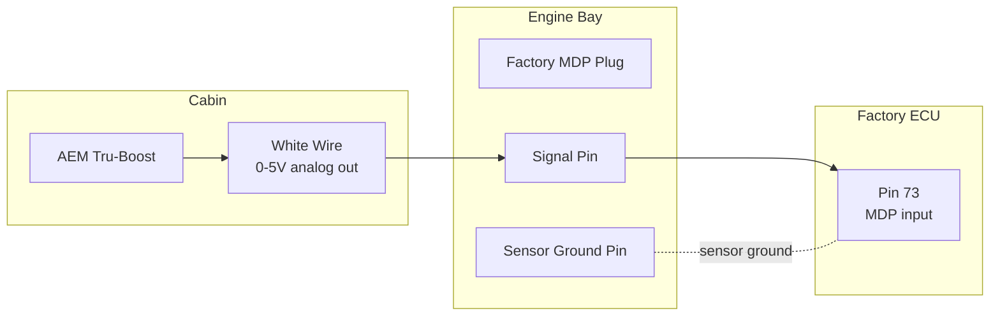
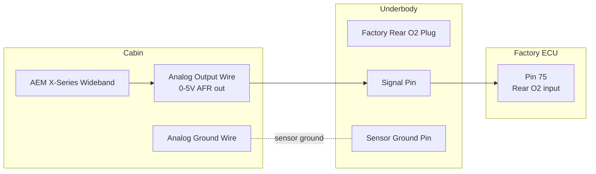
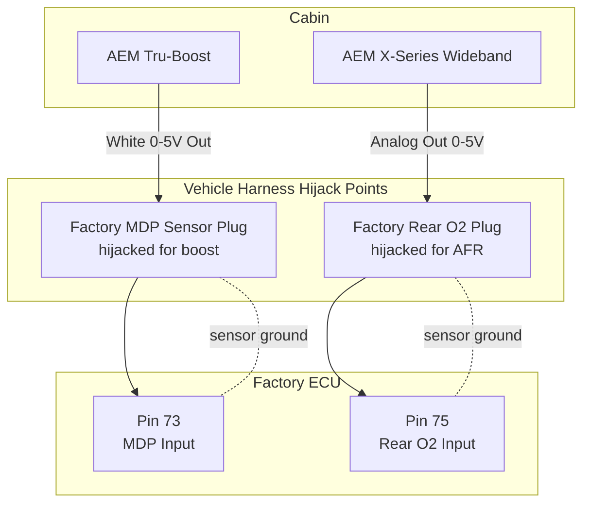

# Wiring the AEM Tru-Boost and Wideband to the Factory ECU

This guide outlines how to connect the AEM Tru-Boost and AEM X-Series Wideband 0-5V analog outputs to the factory ECU. Doing so allows EvoScan to log accurate boost and AFR readings natively through the Tactrix cable without relying on separate USB-to-serial adapters.

## The Hardware Strategy

There are two primary ways to approach this without hacking into your factory engine wire loom: using an ECUPatch Harness inside the cabin, or hijacking factory sensor plugs in the engine bay.

### Approach 1: The Engine-Bay Plug-and-Play (Zero Splicing inside Cabin)

This is the ultimate reversible, non-destructive method. Since the AEM gauges come with lots of wire, you route the 0-5V analog outputs from the cabin gauge through the firewall to existing factory sensor connectors that you are no longer using.

**For Boost (AEM Tru-Boost -> Pin 73):**
The factory 1-bar Manifold Differential Pressure (MDP) sensor is mounted on top of the intake manifold and is not useful beyond atmospheric pressure.
1. Unplug the factory MDP sensor.
2. Purchase a matching mating connector (or salvage one from a junkyard sensor).
3. Wire the Tru-Boost's **White Wire** (0-5V out) to the *Signal* pin of your mating connector.
4. Plug it in. The signal travels perfectly along the factory harness directly to Pin 73 on the ECU.

**Boost path diagram:**


**Important Note - Disabling the MDP CEL:**  
Because the ECU is no longer receiving the expected stock voltage behavior from the MDP sensor, it will trigger a Check Engine Light (CEL) for an MDP sensor malfunction (such as code P0105, P0107, or P0108). 
To fix this, you must use EcuFlash to disable the MDP diagnostic trouble codes in your ROM periphery bits:
- Open your ROM in EcuFlash.
- Navigate to **ECU Periphery0 (Hex)** (often labeled `Periphery 0` at address `FCA` or similar depending on XML).
- Change **Bit 11** to `0` (Disable EGR/MDP/Baro tests).
- Alternatively, if your XML exposes the specific DTC toggles under "ECU Periphery (FCA) Bits", find `Bit 11: EGR/MDP/Baro` and change it from 1 to 0. 

**For AFR / Wideband (AEM X-Series -> Pin 75):**
Since you flashed the ECU to disable the catalytic converter (`e8-t030-disable_cat.hex`), the factory Rear O2 sensor is no longer needed.
1. Locate the Rear O2 sensor plug under the passenger side / center tunnel of the car.
2. Unplug the factory Rear O2 sensor.
3. Purchase a matching connector (or cut the pigtail off an old burnt-out O2 sensor).
4. Wire the Wideband's **Analog Output Wire** (often Blue or White depending on gauge era) to the *Signal* pin on the O2 pigtail.
5. Plug it in. The AFR signal now travels through the factory passenger-seat floor harness directly to Pin 75 on the ECU.

**Wideband path diagram:**


**Combined routing overview:**


    subgraph CABIN[Cabin]

---

### Approach 2: Using a Patch Harness at the ECU
    subgraph ENGINE[Vehicle harness hijack points]
        MDP[Factory MDP Plug<br/>boost signal hijack]
        O2[Factory Rear O2 Plug<br/>AFR signal hijack]
```text
[Factory Wiring Harness] ---> [Plug-and-Play Patch Harness] ---> [Factory ECU]
                                         |
        P73[Pin 73<br/>MDP input]
        P75[Pin 75<br/>Rear O2 input]

**Why this makes it easy:** It sits as a bridge between your factory car plugs and the ECU. You can sit comfortably at a desk, splice the AEM wire directly into the patch harness, and then just walk out to the car and plug it in line.
    TB -->|White wire<br/>0-5V out| MDP --> P73
    WB -->|Analog output<br/>0-5V out| O2 --> P75
    MDP -. sensor ground .- P73
    O2 -. sensor ground .- P75

### 1. Identify Your Pins (2003 Evo VIII 4-Plug ECU)

- **Tru-Boost:** Pin 73 (Manifold Differential Pressure Sensor Input). Located on the 22-pin plug, typically a **Light Green** wire on the factory loom.
- **Wideband AFR:** Pin 75 (Rear O2 Sensor Input). Located on the 16-pin plug, typically a **White** wire on the factory loom.

### 2. Make the Connection

**Option A: Custom Patch Harness Assembly (Recommended)**  
*Note: As of June 2026, Tuning Technology is no longer accepting custom bench-work orders for these harnesses due to resource constraints. The recommended approach is to order their Denso 76-Way Extension Harness with the "harness side connector uninstalled". This gives you bare wires on that end so you can easily run your flying leads, heat-shrink everything neatly, and then snap the connector housing on yourself at your desk.*

**Option B: DIY No-Soldering Method (Using pre-assembled Extension Harness)**  
If you don't want to wire the connector yourself and buy a fully assembled patch harness:

1. Acquire a standard **Denso 76-Way Extension Harness (26p-16p-12p-22p)**.
2. Locate the wire for Pin 73 on the 22-pin plug of the *extension harness*.
3. **Cut it completely in half.** (This disconnects the factory 1-bar sensor on the intake manifold so its voltage doesn't fight the gauge).
4. Strip the insulation off the **ECU-side** of that cut wire on the extension harness, and strip the end of the **AEM White Wire**.
5. Use a high-quality Heat-Shrink Butt Connector or a Posi-Lock wire connector to join the AEM White wire to the ECU side of Pin 73. Shrink it down with a lighter or heat gun to seal it from moisture.
6. Tape up the other side of the cut wire (the side going toward the engine plugs) so it can't short out.
7. Finally, plug the modified extension harness in between your car's factory harness and the ECU.

### 3. Share a Common Ground

For a 0-5V analog signal to be accurate and steady, the gauge and the ECU need to agree on what "0 Volts" feels like.

1. Take the **Analog Ground Wire** from the AEM gauges and splice them into a factory ECU ground wire.
2. Specifically, use **Pin 92 or Pin 98 (Sensor Ground circuit)**. 

This eliminates signal "noise" or fluctuating boost/AFR readings in your logs.

## The Final Software Step in EvoScan

Once it's wired up, you just need to tell EvoScan to look at the ECU pins using the AEM scaling formula instead of the Mitsubishi MUTII math.

**For Boost (Pin 73 / Request 38):**
Replace your old formula in EvoScan with the official AEM 0-5V scaling math:
`Boost (psig) = (9.375 * Voltage) - 14.7`
Because EvoScan reads the 0-5V window as a 0-255 byte value (`x`), the exact EvoScan XML formula string looks like this:
```text
Formula="(0.1838 * x) - 14.7"
```

**For AFR (Pin 75 / Request 3C - Rear O2):**
For the typical AEM X-Series Wideband, the output scale is 0V = 8.5 AFR and 5V = 18.0 AFR.
`(Voltage * 1.9) + 8.5`
Because EvoScan reads a byte `x` from 0-255 representing 0-5V (each byte = 0.0195V):
```text
Formula="0.0371 * x + 8.5"
```
*(Verify your specific gauge's manual for its exact voltage-to-AFR multiplier).*

Once that's typed in, turn the key, and your EvoScan dashboard will Perfectly mirror whatever the physical gauge faces say.
