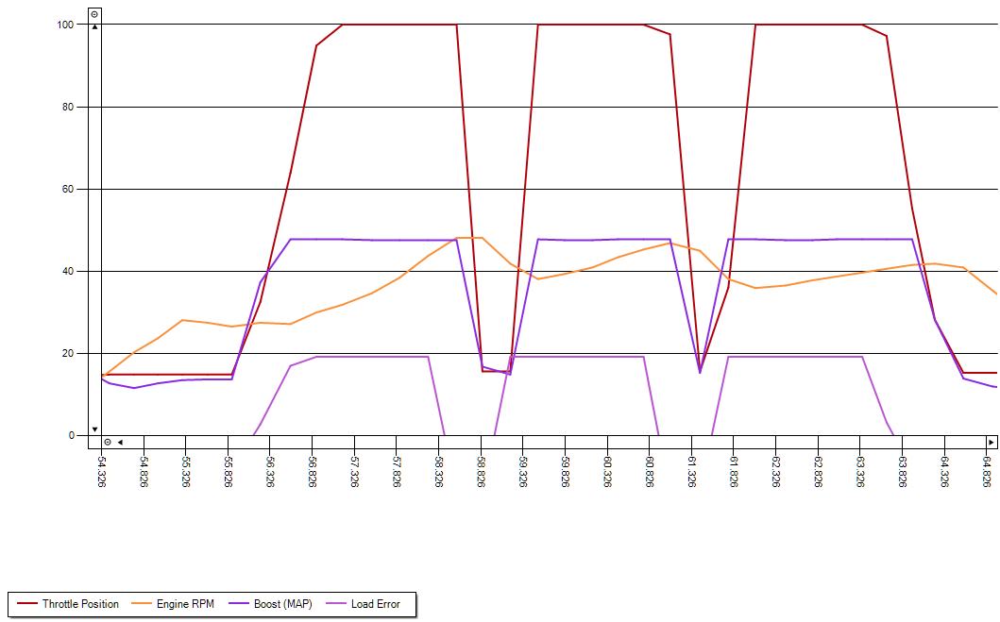

# Evo 8 Tuning Session — Testing Plan Sheet

**Date:** 2026-04-26  
**Vehicle:** 2003 Mitsubishi Lancer Evolution VIII

## Pre-Flight Checklist

- [X] Warm engine to normal operating temperature
- [X] Confirm fuel level and fuel quality are suitable for testing
- [X] Verify no active CELs or critical ECU faults
- [X] Confirm boost/vacuum line routing and clamp tightness
- [X] Verify wastegate preload and reference line integrity
- [X] Confirm AEM TruBoost controller powers on and settings are saved
- [X] Start EvoScan log capture before each pull
- [X] Use the same road section/gear/throttle method for consistency
- [X] Perform pulls only in safe conditions (traffic, surface, temperature)
- [X] Stop immediately if knock, fuel cut, or unstable boost behavior appears

## Baseline Specs

- **Wastegate Crack Pressure (Target):** 12 PSI
- **Initial Boost Setting:** 14 PSI
- **Zero-State (Boost Controller Off):** 12.5 PSI

## Session Objectives

1. Verify actual crack pressure vs. 14 PSI target.
2. Test Boost Control Options A and B on the controller.
3. Complete and document three specific test runs this morning.

## Test Runs

| Run # | Controller Setting (A/B/Off) | Target Boost | Actual Boost | Crack Pressure | Notes | Logs                                                       |
|---|---|-------------:|-------------:|---:|---|------------------------------------------------------------|
| 1 | A |       14 PSI |       18 PSI | 12 PSI | Zero-state validation pass; confirm spring-only behavior | [EvoScanDataLog_2026.04.26_10.27.50.csv](../../logs/EvoScanDataLog_2026.04.26_10.27.50.csv) |
| 2 | A |       16 PSI |        ? PSI | 14 PSI | Validate Option A response and boost stability | [EvoScanDataLog_2026.04.26_10.35.23.csv](../../logs/EvoScanDataLog_2026.04.26_10.35.23.csv) |

## Observations/Logs

- **Run 1 Notes:**
  - Feelt Good but could have started 3rd gear pull at a lower RPM.
  - 
- **Run 2 Notes:**
  - Felt like tghe boost spiked in 3rd gear 
- 
- **General Session Notes:**
  - The adjustment between Run 1 and Run 2 involved increasing the wastegate crack pressure setting on the AEM TruBoost controller. This had the unintended consequence of worsening the boost spike, confirming that the setting was moved in the wrong direction. The correct action is to reduce the crack pressure to achieve a smoother boost curve.

- **Log Files / References:**
  - 

## Test Run Execution

- **[X] Run 1: Initial WOT Pull**
  - **Objective:** Establish a baseline of the boost curve after the controller relocation.
  - **Procedure:** Perform a wide-open throttle pull in 3rd gear from 2500 RPM to redline.
  - **Log File:** `EvoScanDataLog_2026.04.26_10.27.50.csv`

- **[X] Run 2: Confirmation WOT Pull**
  - **Objective:** Verify the behavior observed in the first run.
  - **Procedure:** Repeat the WOT pull in 3rd gear.
  - **Log File:** `EvoScanDataLog_2026.04.26_10.35.23.csv`

## Results and Analysis

The test runs revealed a significant and repeatable boost control problem. In both logs, under wide-open throttle, the following behavior was observed:

1.  **Boost Spike:** The turbo would spool rapidly, with boost pressure spiking to approximately 17psi.
2.  **Sudden Boost Drop:** Immediately following the spike, the boost would drop sharply to around 7psi.
3.  **Slow Recovery:** The boost would then begin to build again, but at a much slower rate.

This entire sequence occurred while the throttle was held at 100% and with no knock detected, ruling out driver error or a protective measure from the ECU due to knock.

The graph from a previous, similar event illustrates this behavior clearly:

This pattern strongly suggests that the wastegate is being prematurely forced open, dumping boost pressure. The issue is directly correlated with the relocation of the AEM TruBoost controller and the re-routing of its vacuum lines. The cause is likely either an incorrect vacuum line setup or an inappropriate setting on the boost controller for the new configuration.

## Next Steps

Based on the analysis, the immediate priority is to resolve the boost control issue.

- **[ ] Action Item 1: Adjust Wastegate Crack Pressure**
  - **Objective:** Smooth out the boost curve and prevent the spike/drop behavior.
  - **Procedure:** Lower the wastegate crack pressure setting on the AEM TruBoost controller. This should make the wastegate open more progressively, preventing the rapid, uncontrolled spool that leads to the spike.
  - **Success Criteria:** A WOT pull shows a smooth boost curve that holds steady at the target pressure without a sudden drop.

- **[ ] Action Item 2 (If Necessary): Inspect Vacuum Line Routing**
  - **Objective:** Ensure the boost controller is plumbed correctly.
  - **Procedure:** If adjusting the crack pressure does not solve the problem, conduct a thorough review of the vacuum lines against the AEM TruBoost installation manual.
  - **Success Criteria:** The vacuum line configuration is confirmed to be correct or is corrected to match the manufacturer's specification.
